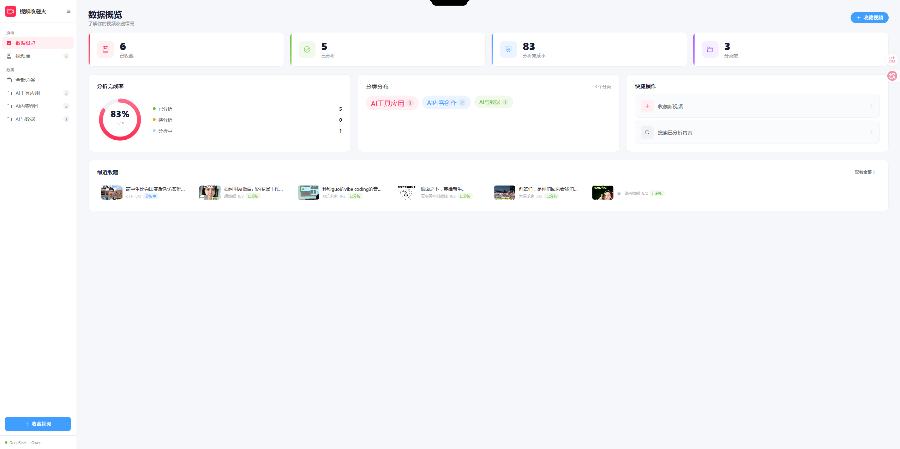
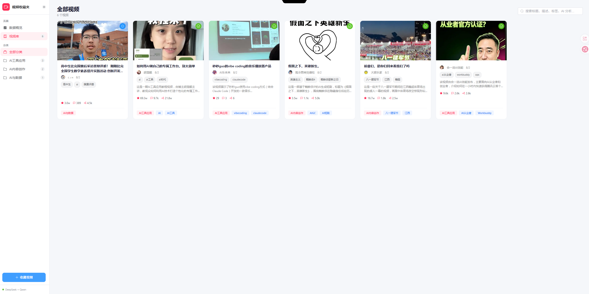
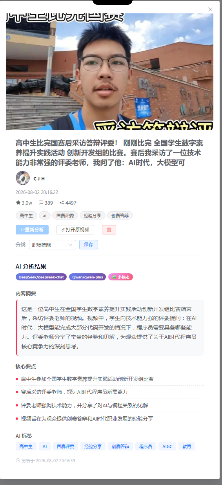
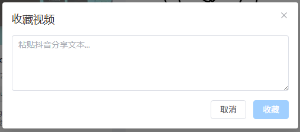
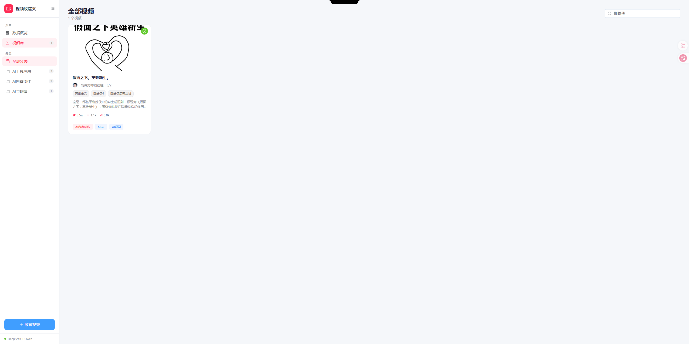
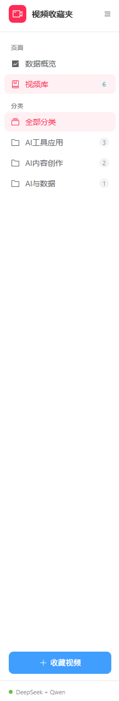

# 抖音视频收藏夹 · AI 智能分析版 — 作业提交

## 一、项目简介

**产品定位**：面向知识工作者的 AI 驱动视频内容管理平台，解决抖音收藏夹"收藏即吃灰"的痛点，通过 AI 自动分析将被动收藏转化为主动知识资产。

**在线 Demo**：https://www.mengqihsh.icu

---

## 二、核心功能截图

### 截图 1：数据概览仪表盘

> **功能说明**：数据概览仪表盘展示视频收藏整体情况。顶部统计卡片实时反映已收藏 6 条视频、已分析 5 条、AI 分析完成率 83%、3 个分类维度等核心指标；中部左侧环形图展示分析状态分布（已分析 5 / 分析中 1 / 待分析 0），中部右侧分类云展示 AI 工具应用（3）、AI 内容创作（2）、AI 与数据（1）三个分类占比；底部「最近收藏」列表横向展示已入库视频的封面、标题、作者及 AI 分析状态标签，支持一键点击进入详情。

---

### 截图 2：视频库卡片列表

> **功能说明**：视频库以卡片网格形式展示所有收藏视频，共 6 条，涵盖 AI 工具应用、AI 内容创作、AI 与数据三大分类。每张卡片包含真实视频封面图、视频标题、作者信息、内容标签（如高中生/ai/国赛评委、ai工具/ai时代/vibecoding 等）、AI 自动生成的一行摘要预览及互动数据（点赞、评论、分享）。卡片高度统一对齐，右上角绿色勾号标识表示该视频已完成 AI 分析。底部蓝色标签为 AI 自动生成的内容分类标签（AI 工具应用 / AI 内容创作 / AI 与数据）。

---

### 截图 3：AI 分析结果详情界面（核心功能）

> **功能说明**：点击视频卡片打开详情弹窗，顶部展示视频封面、完整标题、作者（C J H）、发布时间（2026-08-02 20:16:22）及互动数据（点赞 3.0w / 评论 389 / 分享 4497）。AI 分析结果区域展示四层结构化输出：①**分析来源标识**——顶部显示 DeepSeek/deepseek-chat、Qwen/qwen-plus、多模态三个标签，表明分析调用了多个 AI 模型；②**内容摘要**——AI 自动生成 2-3 句话概括视频核心主题，以红色竖线标注重点；③**核心要点**——提取 4 个关键知识条目，每条以红色圆点引导（高中生参加全国学生数字素养提升实践活动、赛后采访评委老师探讨 AI 时代程序员能力、评委强调技术能力分享见解、为观众提供创赛答辩经验）；④**AI 标签**——自动生成 8 个内容标签（高中生/AI/国赛评委/经验分享/创赛答辩/程序员/AIGC/教育），辅助检索和归类。分析于 2026-08-02 20:16:39 完成。

---

### 截图 4：收藏视频弹窗

> **功能说明**：点击侧边栏「收藏视频」按钮或底部蓝色悬浮按钮，弹出收藏对话框。用户将抖音 App 中复制的分享文本粘贴到输入框中，系统自动解析其中的抖音短链接，提取视频标题、作者、描述、标签、封面图及互动数据（点赞/评论/分享数），完成元数据抓取与结构化入库。解析成功后，系统立即自动触发 AI 分析，无需用户手动操作。

---

### 截图 5：智能搜索功能

> **功能说明**：在视频库页面顶部搜索框输入"蜘蛛侠"，系统基于 SQLite FTS5 全文检索引擎，不仅匹配视频标题和描述，还匹配 AI 生成的摘要和要点内容。搜索结果显示 1 条匹配视频《假面之下，英雄新生》，该视频标题中未直接包含"蜘蛛侠"一词，但 AI 分析摘要在要点中提到了相关内容，因此仍被检索召回，实现深度内容检索。右侧分类统计同步更新（AI 内容创作 2 / AI 工具应用 3 / AI 与数据 1）。

---

### 截图 6：侧边栏分类导航

> **功能说明**：左侧固定侧边栏提供全局导航能力。顶部「页面」区域包含数据概览和视频库两个入口；「分类」区域展示系统自动识别的三大分类——AI 工具应用（3 条）、AI 内容创作（2 条）、AI 与数据（1 条），每个分类后标注视频数量，点击即可筛选对应分类的视频列表。底部蓝色「收藏视频」按钮支持一键打开收藏弹窗，底部绿色标识显示当前 AI 提供商状态（DeepSeek + Qwen）。

---

## 三、AI 介入环节说明

| 环节          | 触发时机            | AI 能力                                              | 输出结果                                 |
| ----------- | --------------- | -------------------------------------------------- | ------------------------------------ |
| **智能分类**    | 视频入库时自动触发       | 基于标题/描述/标签关键词匹配预设规则                                | 自动归类到 AI 工具应用 / AI 内容创作 / AI 与数据     |
| **AI 内容分析** | 收藏成功后自动触发（无需手动） | 调用 DeepSeek + Qwen 双模型分析，元数据提取→内容理解→摘要生成→要点提取→标签推荐 | 内容摘要（2-3 句）、核心要点（4-5 条）、AI 标签（5-8 个） |
| **搜索扩展**    | 用户输入搜索词时        | 基于 FTS5 全文检索 + AI 语义匹配                             | 不仅匹配标题，还匹配 AI 摘要和要点内容                |

**技术架构**：前端 Vue 3 + Element Plus，后端 FastAPI，数据库 SQLite + FTS5 全文检索，AI 层 DeepSeek API + Qwen API 双模型调度，部署于 Vercel Serverless。

---

## 四、截图完整性自查

| 作业要求             | 满足情况                                |
| ---------------- | ----------------------------------- |
| 至少 3 张截图         | ✅ 共 6 张                             |
| 每张下方有文字说明        | ✅ 全部附带详细说明                          |
| 至少 1 张展示 AI 实际输出 | ✅ 截图 3 明确展示 DeepSeek + Qwen 分析结果    |
| 图文逻辑紧密           | ✅ 截图从仪表盘→视频库→AI分析→收藏→搜索→导航，完整还原使用流程 |
| 清晰度高             | ✅ 截图分辨率充足，界面元素清晰可见                  |
